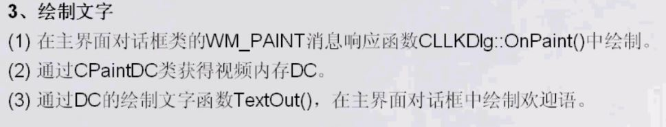
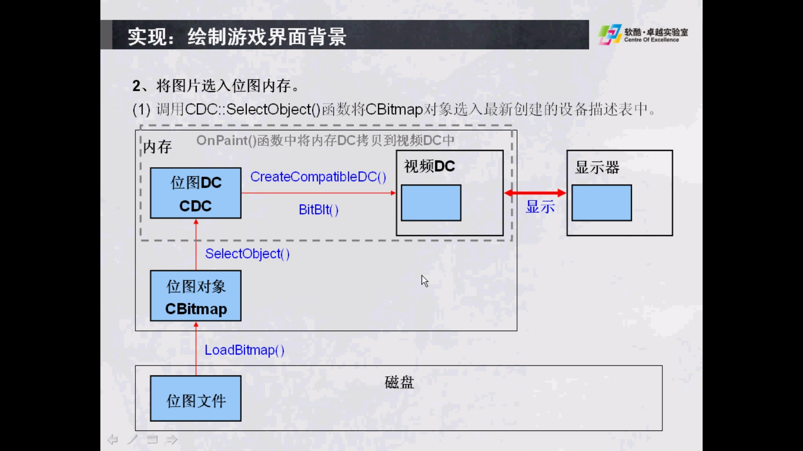

## 显示文字

```c++
void CLLKDlg::OnPaint(){
   CPaintDC dc(this);

   //创建字体
   CFont font;
   font.CreatePointFont(200, L"Cambria");
   CFont * oldFont;
   oldFont = dc.SelectObject(&font);

   //设置字体颜色
   dc.SetTextColor(RGB(0, 0, 255));

   //获取字体位置
   CRect rect;
   GetClientRect(&rect);

   //字体内容
   CString strText = L"Welcom to LLK-GAME!";
   CSize size;
   size = dc.GetTextExtent(strText, strText.GetAllocLength());

   //居中显示
   int x = (rect.Width() - size.cx) / 2;
   int y = (rect.Height() - size.cy) / 2;
   dc.TextOut(x, y, strText);
}
```
<hr>
## 显示位图


```c++
void CLLKDlg::OnPaint(){
   //额外添加在自动生成的else里面
   CPaintDC dc(this);

   //将内存DC复制到视频DC，内存DC在头文件类中定义
   dc.BitBlt(0, 0, 800, 600, &m_DCMem, 0, 0, SRCCOPY);
}

//此函数为自定义函数，在头文件中添加
void CLLKDlg::InitBackground() {
   //加载位图
   CBitmap bmpmain;
   bmpmain.LoadBitmap(IDB_MAIN_BG);

   //创建兼容dc
   CClientDC dc(this);
   m_DCMem.CreateCompatibleDC(&dc);

   //将位图选进dc
   m_DCMem.SelectObject(&bmpmain);
}

```

以下方式能完成功能
1、保存背景图片在m_dcBG
2、以后可以利用m_dcBG完成对m_dcMem的刷新，进而刷新视频dc
发现m_dcMem和m_dcBG是为同一个视频dc创建的兼容dc
```c++
void CGameDlg::InitBackground() {
   //::是调用API，加载位图

   //获得当前视频dc
   CClientDC dc(this);

   //加载bmp图片
   HANDLE bmp = ::LoadImage(NULL, _T("res\\theme\\picture\\game_bg.bmp"), IMAGE_BITMAP, 0, 0,     LR_LOADFROMFILE);

   //创建与视频内存兼容DC
   m_dcBG.CreateCompatibleDC(&dc);

   //将位图资源选进DC
   m_dcBG.SelectObject(bmp);

   //初始化内存DC
   m_dcMem.CreateCompatibleDC(&dc);
   CBitmap bmpMem;
   bmpMem.CreateCompatibleBitmap(&dc,800,600);
   m_dcMem.SelectObject(bmpMem);

   //绘制背景到内存中
   m_dcMem.BitBlt(0, 0, 800, 600, &m_dcBG, 0, 0,SRCCOPY);
}

void CGameDlg::UpDateMap()
{
   int nTop = m_ptGameTop.y;
   int nLeft = m_ptGameTop.x;
   int nElemW = m_sizeElement.cx;
   int nElemH = m_sizeElement.cy;

   m_dcMem.BitBlt(m_rtGameRect.left, m_rtGameRect.top, m_rtGameRect.Width(), m_rtGameRect.Height(), &m_dcBG, m_rtGameRect.left, m_rtGameRect.top, SRCCOPY);

   for (int i = 0; i < 4; i++)
   {
     for (int j = 0; j < 4; j++)
	   {
	      if (m_anMap[i][j] != -1)
	  	  {
		  m_dcMem.BitBlt(nLeft + j * nElemW, nTop + i * nElemH, nElemW, nElemH, &m_dcElement, 0, m_anMap[i][j] * nElemH, SRCCOPY);
		  }
	   }
    }

}

```


另外注意利用vs2017加载资源文件时有可能在文件中看不到bmp文件，此时把列表中文件类型改为所有文件即可。


