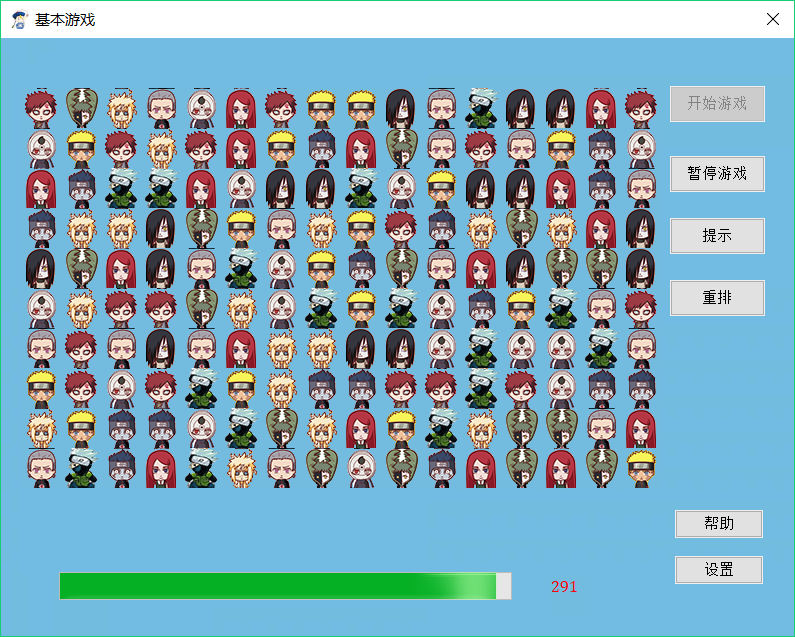

## 更换按钮caption
```c++
this->GetDlgItem(IDC_BT_WAIT)->SetWindowText(L"暂停游戏");
this->GetDlgItem(IDC_BT_WAIT)->SetWindowText(L"继续游戏");
```

## 使按钮处于非点击状态
```c++
this->GetDlgItem(IDC_BT_NORMAL_SET)->EnableWindow(false);
```

## 如何判断拐点
```c++
//利用等差数列
bool CGameLogic::IsCorner()
{
    if (m_nVertTexNum >= 3)
    {
        if ((m_avPath[m_nVertTexNum - 1] + m_avPath[m_nVertTexNum - 3]) / 2 != m_avPath[m_nVertTexNum - 2])
        {
            return true;
        }
    }
    return false;
}


```

## 深度优先搜索，核心算法
```c++
bool CGameLogic::SearchPath(CGraph &g ,int nV0,int nV1)
{
    //得到顶点数
    int nVexNum = g.GetVertNum();

    //遍历途中nV0行，从0列到nVexMax列，值为true的点
    for (int nVi = 0; nVi < nVexNum; nVi++)
    {
        if (g.GetArc(nV0, nVi) == true && !IsExit(nVi))
        {
            //压入当前点，假设为路径的一个有效顶点
            PushVertTex(nVi);
            if (m_nCornerNum > 2)
            {
                PopVertTex();
                continue;
            }

            //当中间点不是nV1时，继续搜寻下一个相邻且连通的点
            if (nVi != nV1)
            {
                //当中间点不为空时，表示该路径不通
                if (g.GetVertex(nVi) != BLACK)
                {
                    //取出压入点
                    PopVertTex();
                    continue;
                }

                //如果nV1是一个已经消除的点，则判断(nV1和nV1）是否连通
                if (SearchPath(g, nVi, nV1))
                {
                    //为true表示找到一条连通路径
                    return true;
                }
            }
            //搜索到终点
            else
            {
                return true;
            }
            PopVertTex();
        }
    }

    return false;
}
```
## 进度条的使用
```c++
	//初始进度条
	m_gameProcess.SetRange(0, 5 * 60);
	//设置步长
	m_gameProcess.SetStep(-1);
	//初始值
	m_gameProcess.SetPos(300);
	this->SetTimer(12,1000,NULL);

```
```c++
void CGameDlg::OnTimer(UINT_PTR nIDEvent)
{
    if (nIDEvent == 12)
    {
        int pos=m_gameProcess.GetPos();
        drawFont(pos);
        //m_time--;
        //m_gameProcess.SetPos(pos - 1);
        m_gameProcess.StepIt();
    }

    CDialogEx::OnTimer(nIDEvent);
}


```
## 效果

