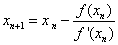
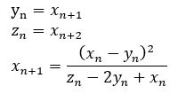

## 二分法搜索根
```py
import numpy

def f (x):
    x=float(x)
    c= pow(x,4)+2*pow(x,3)+pow(x,2)-5
    return c;


def search():
    ep = input("输入精度")
    ep =float(ep)
    a=input("输入区间a,b")
    a=float(a)
    b=input()
    b=float(b)
    if f(a)==0:
        x=a
    elif f(b)==0:
        x=b
    else:
        while (b-a)/2>ep:
            m=(a+b)/2
            if f(a)*f(m)>0:
                a=m
            elif f(b)*f(m)>0:
                b=m;
        x=(a+b)/2
    print(x)

if __name__=="__main__":
    search()

```
---
## 简单迭代法

```py
import numpy as np

## 求解 x^5 + 5x^4 -41 = 0 在[1,3]的单根
## 注意 x = (-x^5 +41)/5 不收敛
## 

def f(x):
    return (-5*x+41)**0.2

def seach():
    x=input("输入迭代初值: ")
    x= float(x) 
    nmax=input("输入迭代最大次数: ")
    nmax =int(nmax)
    ep = input("输入精度: ")
    ep = float(ep)
    n=0
    x1=x
    for i in range(0,nmax):
        x1 = x
        x = f(x1)
        n=n+1
        if abs(x-x1)<=ep:
            break;
    if i < nmax:
        print(x)
    else:
        print("超过最大迭代次数!")

if __name__=="__main__":
    seach()
```
---
## 牛顿迭代法
迭代公式 

```py
## 牛顿迭代法
## f(x)=0


## 求解 x^3 -2x -55 = 0 在区间 [3,4] 的根,以4为初值

import numpy as np

def f(x):
    return x - (x**3-2*x-55)/(3*x**2-2)

def seach():
    x=input("输入迭代初值: ")
    x= float(x) 
    nmax=input("输入迭代最大次数: ")
    nmax =int(nmax)
    ep = input("输入精度: ")
    ep = float(ep)
    n=0
    x1=x
    for i in range(0,nmax):
        x1 = x
        x = f(x1)
        n=n+1
        if abs(x-x1)<=ep:
            break;
    if i < nmax:
        print(x)
    else:
        print("超过最大迭代次数!")

if __name__=="__main__":
    seach()

```
---
## 艾特金加速法
<div style="float:left;">

</div>
</br></br></br></br>
```py
## 艾特金加速迭代法
## yn = x(n+1)
## zn = x(n+2)
## x(n+1) = x(n) - (yn - x(n))^2/(zn - 2y + x)


import numpy as np

## 求解 x^5 - 3x^4 -1 = 0 在3附近的单根
## 变形为 x = 3 + 1/x^4

def f1(x):
    return 3 + 1/x**4

def f(x):
    y = f1(x)
    z = f1(y)
    return x - (y-x)**2/(z-2*y+x)

def seach():
    x=input("输入迭代初值: ")
    x= float(x) 
    nmax=input("输入迭代最大次数: ")
    nmax =int(nmax)
    ep = input("输入精度: ")
    ep = float(ep)
    n=0
    x1=x
    for i in range(0,nmax):
        x1 = x
        x = f(x1)
        n=n+1
        if abs(x-x1)<=ep:
            break;
    if i < nmax:
        print(x)
    else:
        print("超过最大迭代次数!")

if __name__=="__main__":
    seach()
```
---
## 变形双点截弦法
```py

##变形的双点弦截法
## x(n+1) = x(n) - ((x(n)-x(n-1))/f(x(n))-f(x(n-1)))


import numpy as np

## x^4 + 2x^3 + x^2 -5 =0 在[0,2]范围内单根,取x0=0,x1 =2


def f(x):
    return x**4 + 2*x**3 + x**2 -5

def seach():
    x0=input("输入迭代初值x0: ")
    x1=input("输入迭代初值x1: ")
    x0= float(x0) 
    x1= float(x1) 
    nmax=input("输入迭代最大次数: ")
    nmax =int(nmax)
    ep = input("输入精度: ")
    ep = float(ep)
    f0 = f(x0)
    f1 = f(x1)
    n =0    
    
    for i in range(0,nmax):
        x = x1 - f1*(x1 - x0)/(f1 - f0)
        y = f(x)

        x0 = x1
        f0 = f1
        x1 = x
        f1 = y
        if (y==0):
            break;
        n=n+1
        if abs(x0-x1)<=ep:
            break;
    if i < nmax:
        print(x)
    else:
        print("超过最大迭代次数!")

if __name__=="__main__":
    seach()
```


            


            


            


            


