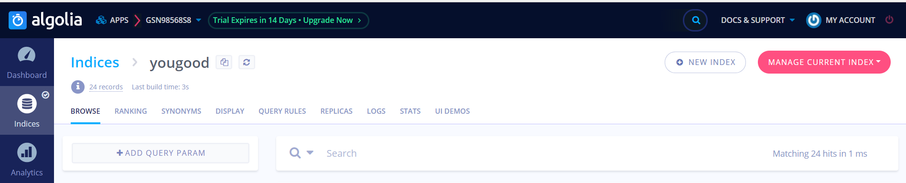
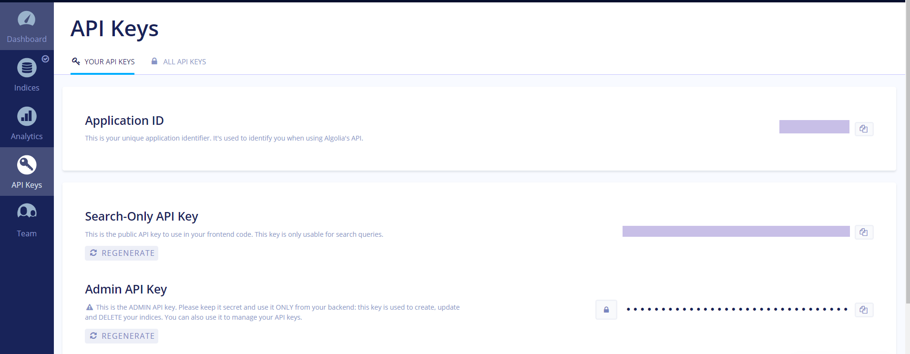
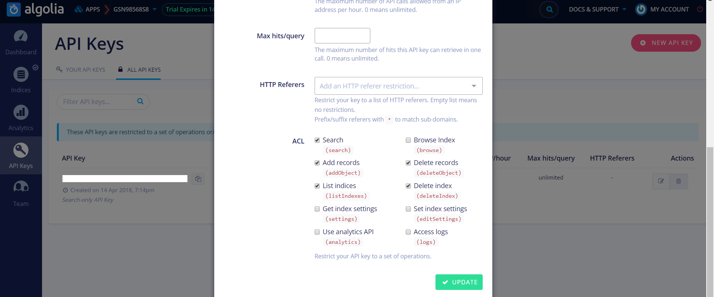

真是蛋疼的要命！
参考了许多文章，终于成功了，总结一下。
# algolia方面
github登陆进去后，选择indices，然后新建一个index：


之后点击ApiKeys,三个keys待会会用到:

之后来到这个页面，勾选一下：


# hexo方面
在hexo文件夹内右键gitbrash,输入命令下载algolia搜索插件（据说免费）
```
npm install hexo-algolia@0.2.0
```

在hexo _config.yml 中添加代码(对齐很重要，开始由于没对齐，花了很长时间寻找问题)
代码需要填写之前页面的ApiKey：
```
algolia:
  applicationID: xxxxxx
  apiKey: xxxxxx
  adminApiKey: xxxxxx
  indexName: xxxxxx
  chunkSize: 5000
  fields:
    - title
    - slug
    - path
    - content:strip
```
在next文件夹的_config.yml找到相应代码修改为：
```
algolia_search:
  enable: true
  hits:
    per_page: 10
  labels:
    input_placeholder: "输入关键词"
    hits_empty: "没有找到相关内容.-_-."
    hits_stats: "${hits} 条相关记录,共耗时 ${time} ms."
```
之后，运行代码使信息同步到algolia.com上面：
```
hexo algolia
```
应该就可以了。。。。

但是我还遇到了问题，能成功搜索出来信息，点击却无法反应？
因为path信息没有同步到algolia网站上，我之前用的这条命令：
```
npm install --save hexo-algolia
```
然而,手机端无法进行点击,应该是阴影覆盖了,修改文件中的z-index就好了。路径themes\next\source\css\_common\components\third-party中的algolia-search.styl
```
.algolia-pop-overlay
  position: fixed
  width: 100%
  height: 100%
  top: 0
  left: 0
  z-index: 2080   //这一行删除
  background-color: rgba(0, 0, 0, 0.3)
```

花了很长时间才发现0.2.0版本有妙解，也就是前面所用的命令。
终于能享受一波搜索乐趣了, 表情逐渐稳定~~

