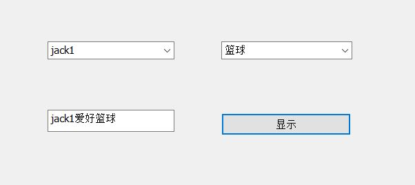

&nbsp;&emsp; 利用mfc要完成效果如图：
<br>


* 创建mfc工程，选择对话框项目，选择资源文件的xxxx.rc2，进入后选择dialog,之后利用添加控件combobox
* 右键控件，添加变量m_cbox
* 添加控件Item,在OnInitDialog()中添加：
```c++
	m_cList1.AddString(L"jack1");
	m_cList1.AddString(L"jack2");
```
	或者直接在属性中data中添加，注意两个变量间要以;(分号)隔开

* 获取变量内容：
```c++
	CString msg;
	m_cList1.GetLBText(m_cList1.GetCurSel(), msg);
```
	msg 是一个全局变量用于传递消息

* button 设置显示内容:
```c++
	UpdateData(TRUE);
	m_edit = msg+L"爱好"+msg2;
	UpdateData(FALSE);
```


* Done

&nbsp ;&emsp ; 为空格,.=_=.(去掉分号与字母间的空格才可以)